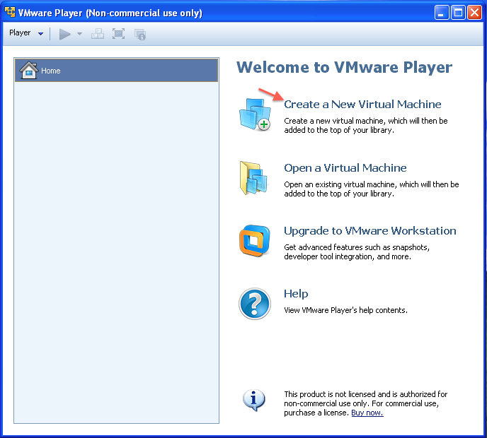
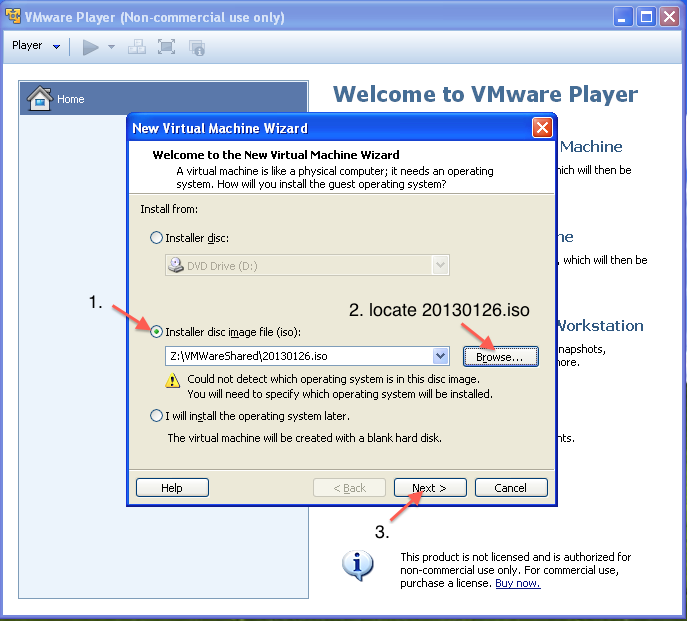
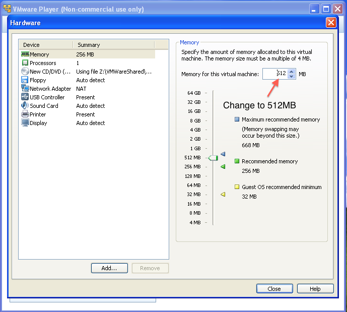
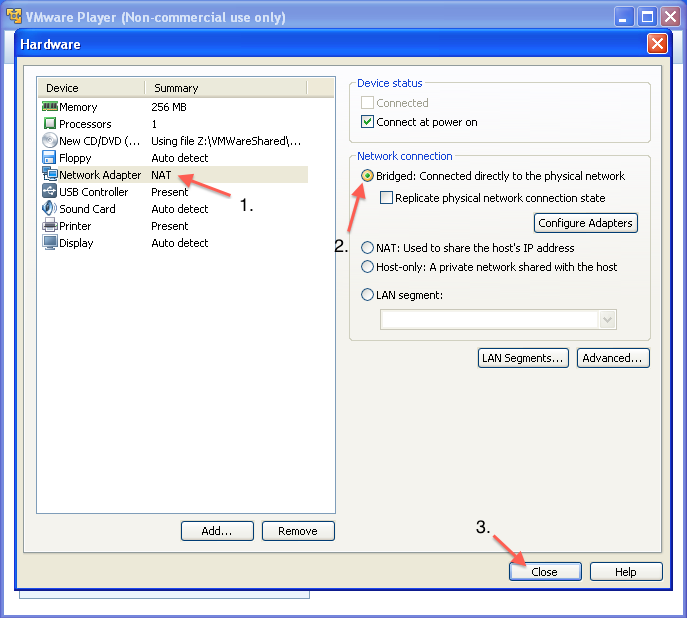
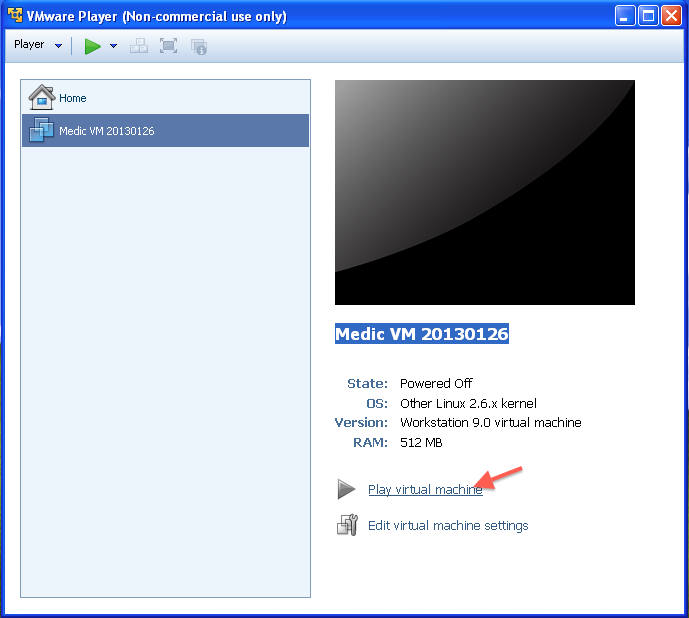
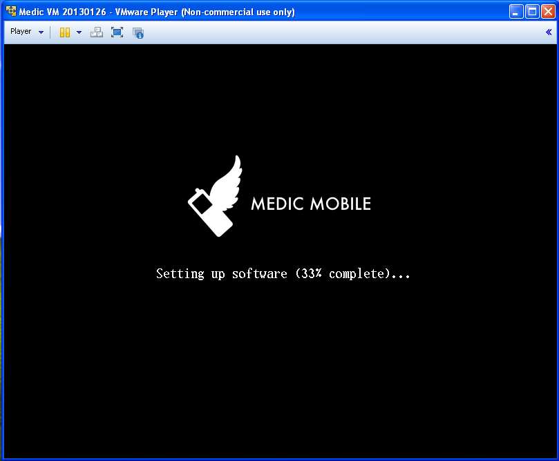
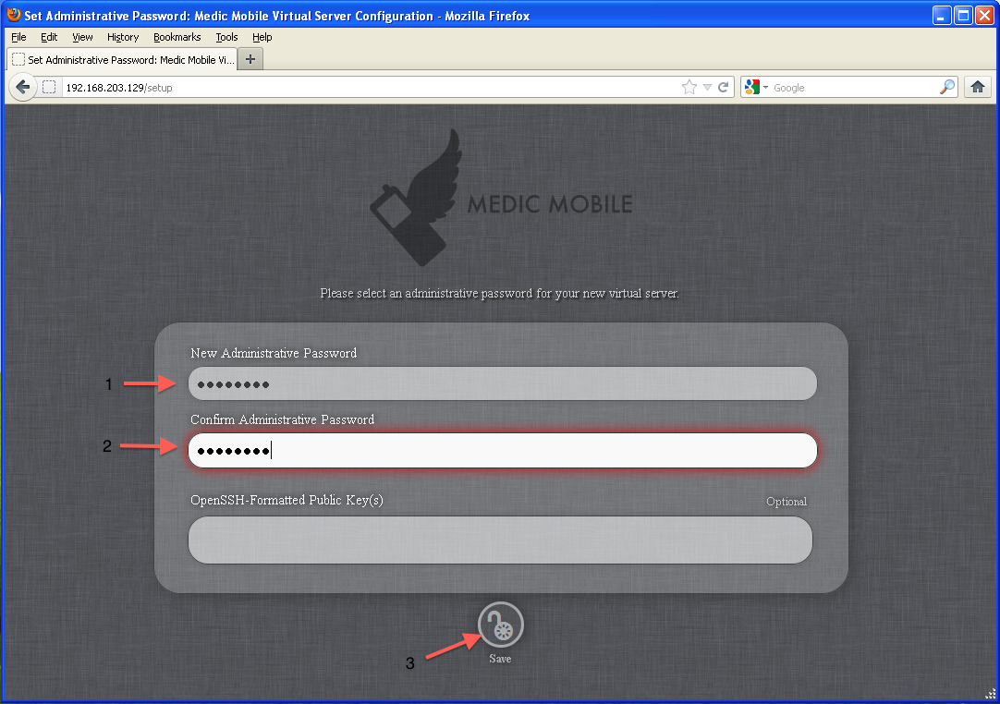

# Virtual Appliance Install with VMWare Player

This document will take you through the recommended steps to install the 
the Medic Mobile Virtual Appliance.

## Download the ISO

* Download the [latest bootable ISO image](http://dev.medicmobile.org/downloads/mmva/).

* Move it out of the downloads folder, give it a permanent home in your file
  structure.  The virtual machine will need to reference it on boot.

## Install VMWare Player

### Download 

1. Go to the [VMWare Player Products](http://www.vmware.com/products/player/) page.
2. Download and install the latest version for your operating system.

## Create New Virtual Machine

* Once installed, launch VMWare Player
* On the launch screen choose Create New Virtual Machine

### Select Bootable ISO file

* Select the ISO file.  Note: your filename might be different, this is just an example.

### Select Linux OS

### Change VM Name
 
* Create a name.  Note: You can create any name you want here, this is just an
example. Typically you name the VM to match the date of the ISO file.

### Specify 64G of maximum disk capacity

The VM will only use as much space as it needs, and if it uses the limit you
can easily adjust it.  You should create a maximum so the host operating system
is not affected if the VM fills up.

### Choose Customize Hardware

### Change memory setting

We recommend a minimum of 512MB of RAM for the VM. The VM will only use what it
needs, but having a limit keeps the the host operating system performance from
degrading.

### Use Bridged Networking

This allows the local network to access the VM. In our typical setup we want to
connect to the IP with SMSSync.

### Finish

Verify your settings are correct and click Finish.

## Setup Medic VM

### Click Play

On first run the VM will do some software copy and setup.  You should see progress messages changing.

When the VM is up and running normally you will see this screen.

### Set a password to secure the virtual machine.

Navigate to the IP address in your browser and enter a password twice into the form.

Copy the password down somewhere safe so you don't lose or forget it.

Great, your VM is running! 

Next: [Install some apps](garden.md)
